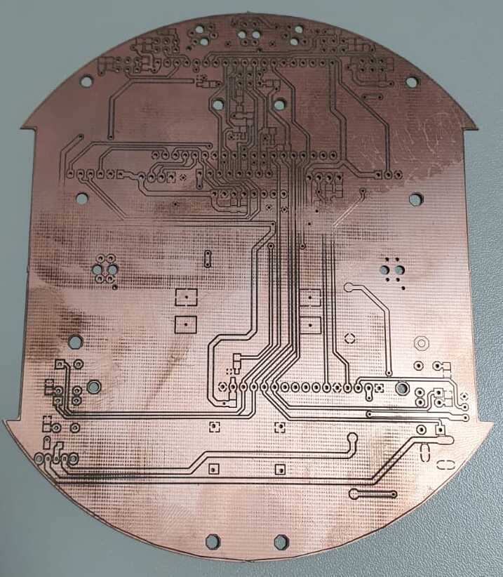

# Robô para labirinto

## Convenções
- **Código** deve ser escrito em **português**
- **Variáveis** devem ser escritas em **português**

## Variáveis
- Nome das **variáveis** devem ser escritas em **lowerCamelCase**

## Funções
- Nome das **funções** devem ser escritas em **lowerCamelCase**

## Implementações
- [ ] Segue a linha (Controle proporcional) 
- [ ] Realizar cruzamentos (90 direita, esquerda e 180 graus) 
- [ ] Ler distância de obstáculos com o ultrasom e realizar filtragem - Sugestão, média móvel! 
- [ ] Visualizar parâmetros do Robô no LCD (Distância do Ultrassom, sensores de linha, e estado da bateria) 
- [ ] Visualizar todos os sensores do Robô em dasboard Grafana ou similar
- [ ] Sair do labirinto

## Bugs

## Melhorias